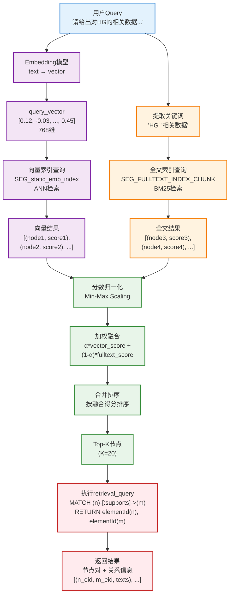
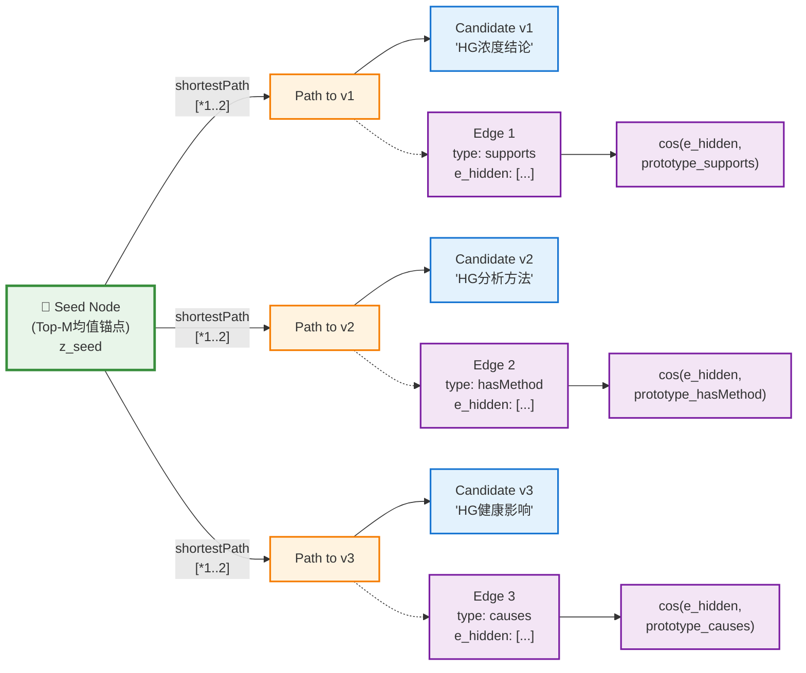
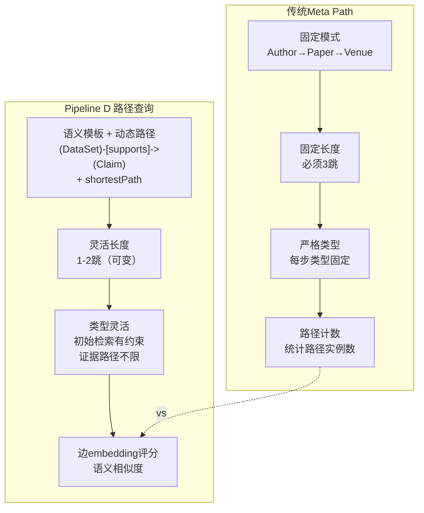
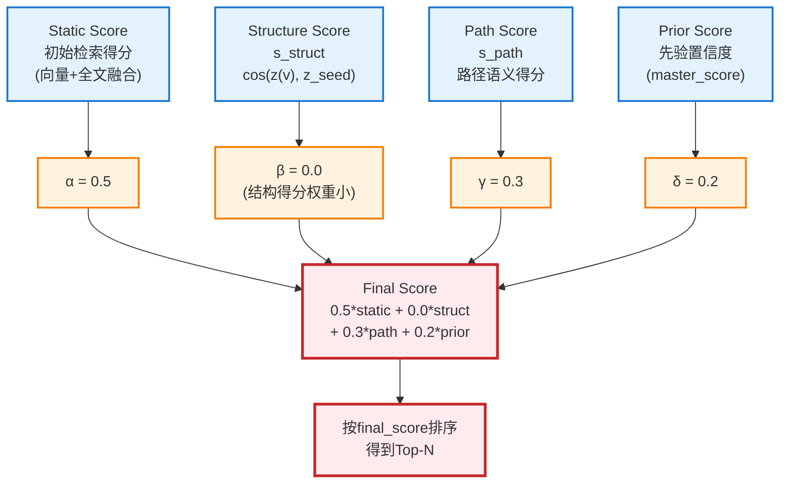
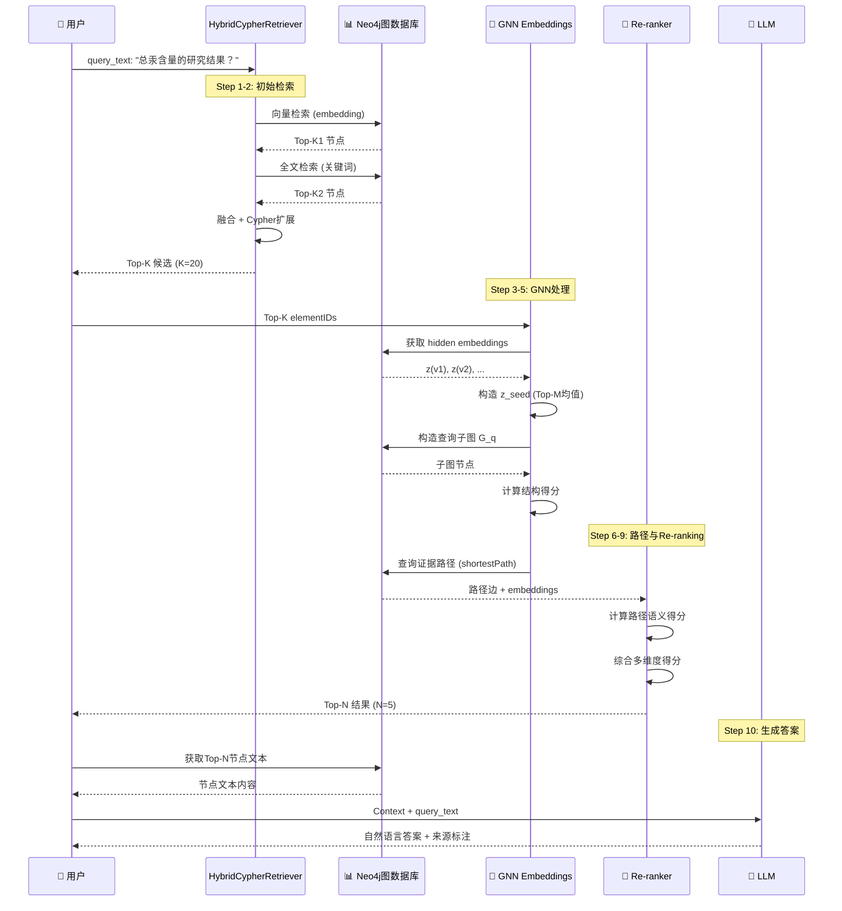
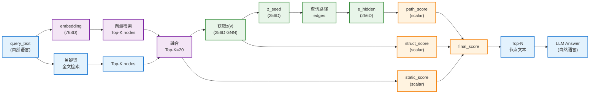

# Pipeline D 可视化流程图

## 图1: 用户Query到最终Answer的完整流程

```mermaid
graph TD
    %% 样式定义
    classDef userStyle fill:#e1f5fe,stroke:#01579b,stroke-width:3px
    classDef retrievalStyle fill:#f3e5f5,stroke:#7b1fa2,stroke-width:2px
    classDef gnnStyle fill:#e8f5e9,stroke:#388e3c,stroke-width:2px
    classDef pathStyle fill:#fff3e0,stroke:#f57c00,stroke-width:2px
    classDef rerankStyle fill:#ffebee,stroke:#c62828,stroke-width:2px
    classDef llmStyle fill:#e3f2fd,stroke:#1976d2,stroke-width:3px

    %% 用户输入
    USER["👤 用户输入<br/>query_text:<br/>'总汞含量的研究有哪些结果？'"]:::userStyle
    
    %% Step 1-2: 初始检索
    USER --> HYBRID["Step 1-2: HybridCypherRetriever<br/>🔍 双通道检索"]:::retrievalStyle
    
    HYBRID --> VEC["向量通道<br/>query_text → embedding<br/>→ 向量索引"]:::retrievalStyle
    HYBRID --> FULL["全文通道<br/>query_text → 关键词<br/>→ 全文索引"]:::retrievalStyle
    
    VEC --> MERGE["分数融合<br/>归一化 + 加权"]:::retrievalStyle
    FULL --> MERGE
    
    MERGE --> CYPHER["Cypher扩展<br/>(DataSet)-[supports]->(Claim)"]:::retrievalStyle
    
    CYPHER --> TOPK["Top-K 候选节点<br/>(K=20)<br/>elementIDs: [n1, n2, ..., n20]"]:::retrievalStyle
    
    %% Step 3: 构造锚点
    TOPK --> SEED["Step 3: 构造锚点 z_seed<br/>取Top-M (M=3)的<br/>GNN hidden embedding均值"]:::gnnStyle
    
    %% Step 4: 构造子图
    SEED --> SUBG["Step 4: 构造查询子图 G_q<br/>以seed为中心<br/>1-3跳邻域"]:::gnnStyle
    
    %% Step 5: 结构得分
    SUBG --> STRUCT["Step 5: 计算结构得分<br/>s_struct(v) = cos(z(v), z_seed)"]:::gnnStyle
    
    %% Step 6: 证据路径
    STRUCT --> PATH["Step 6: 抽取证据路径<br/>对每个候选v:<br/>shortestPath((seed)-[*1..2]-(v))"]:::pathStyle
    
    %% Step 7-8: 路径得分
    PATH --> PATHSCORE["Step 7-8: 路径语义得分<br/>对路径上每条边e:<br/>score = cos(e_hidden, prototype)<br/>s_path(v) = mean(scores)"]:::pathStyle
    
    %% Step 9: Re-ranking
    PATHSCORE --> RERANK["Step 9: Graph-aware Re-ranking<br/>final_score = 0.5*static + 0.3*path<br/>+ 0.2*prior + 0.0*struct"]:::rerankStyle
    
    RERANK --> TOPN["Top-N 结果<br/>(N=5)<br/>排序后的候选节点"]:::rerankStyle
    
    %% Step 10: LLM生成
    TOPN --> LLM["Step 10: LLM生成答案<br/>Context: Top-N节点文本<br/>Question: query_text"]:::llmStyle
    
    LLM --> ANSWER["📝 自然语言答案<br/>(附带来源标注)"]:::llmStyle
    
    ANSWER --> USEROUT["👤 返回给用户"]:::userStyle
```

## 图2: Step 1-2 HybridCypherRetriever详细流程

## 图3: Step 6 证据路径查询详解

## 图4: 路径查询与Meta Path的对比

## 图5: Re-ranking多维度得分融合

## 图6: 完整的Query-Answer循环

## 图7: 数据流与维度变化

## 关键流程总结

### 1. 用户Query的多次使用
- **Step 1-2**: 直接用于检索（embedding + 关键词）
- **Step 10**: 直接用于LLM提示词

### 2. 路径查询的两个层次
- **初始检索**: 使用预定义语义模板（类似Meta Path）
- **证据路径**: 使用动态最短路径查询（不是Meta Path）

### 3. GNN Hidden Embeddings的作用
- **节点embedding**: 用于结构得分
- **边embedding**: 用于路径语义得分

### 4. 多维度融合
- Static (50%): 初始检索相关性
- Path (30%): 证据路径质量
- Prior (20%): 先验置信度
- Struct (0%): 结构相似度（权重可调）

这个Pipeline实现了**从自然语言Query到自然语言Answer的完整闭环**，充分利用了图结构、GNN表示学习和LLM生成能力。

