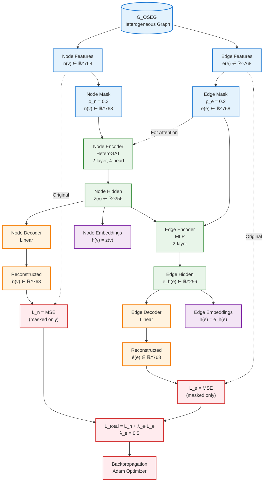
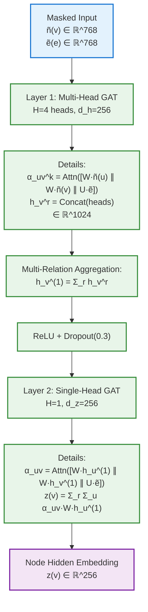
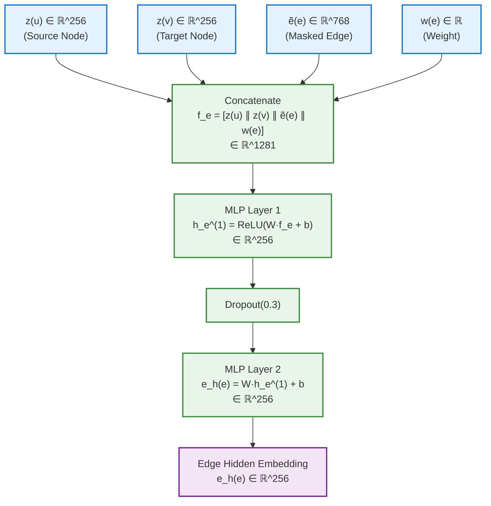
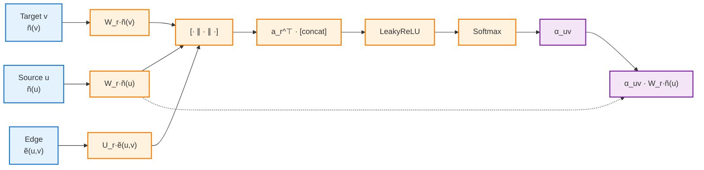
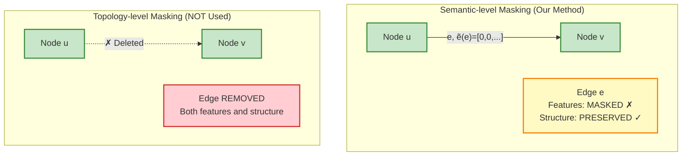
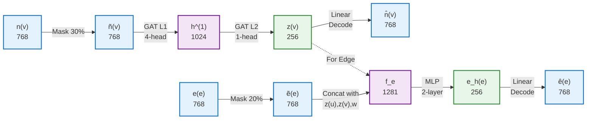

# OAS-GAT-EM 架构图 (Mermaid格式)

## 可以直接在GitHub、Jupyter、或支持Mermaid的Markdown查看器中渲染

### 图1: 整体架构流程图



### 图2: Node Encoder详细结构



### 图3: Edge Encoder详细结构



### 图4: 注意力机制详细结构



### 图5: Masking策略对比



### 图6: 训练流程

```mermaid
sequenceDiagram
    participant Data as Input Data
    participant Mask as Masking
    participant Enc as Encoders
    participant Dec as Decoders
    participant Loss as Loss Function
    participant Opt as Optimizer
    
    Data->>Mask: Original features
    Note over Mask: 30% nodes<br/>20% edges
    Mask->>Enc: Masked features
    Note over Enc: HeteroGAT + MLP
    Enc->>Dec: Hidden embeddings
    Note over Dec: Linear layers
    Dec->>Loss: Reconstructions
    Data->>Loss: Original features
    Note over Loss: MSE on masked only
    Loss->>Opt: Gradients
    Opt->>Enc: Update parameters
    Opt->>Dec: Update parameters
    
    loop Training Epochs (20)
        Mask->>Enc: New masks per epoch
    end
```

### 图7: 数据流与维度变化



## 使用说明

1. **GitHub/GitLab**: 这些Mermaid图会自动渲染
2. **Jupyter Notebook**: 需要安装 `jupyter-mermaid` 扩展
3. **Markdown编辑器**: 使用支持Mermaid的编辑器（如Typora, VS Code）
4. **在线工具**: 可以在 https://mermaid.live 查看和编辑

## 导出为论文图片

可以使用以下工具将Mermaid图导出为高质量图片：

1. **Mermaid CLI**: `mmdc -i input.mmd -o output.png -w 2000 -H 1500`
2. **在线编辑器**: https://mermaid.live （可导出PNG/SVG）
3. **VS Code**: 安装 Markdown Preview Mermaid Support 扩展
4. **Draw.io**: 支持导入Mermaid代码

## 推荐论文使用方案

1. **主架构图**: 使用图1（整体架构流程图）
2. **技术细节图**: 使用图2（Node Encoder）和图3（Edge Encoder）
3. **Attention机制**: 使用图4
4. **补充材料**: 使用图5-7作为附录或补充说明


